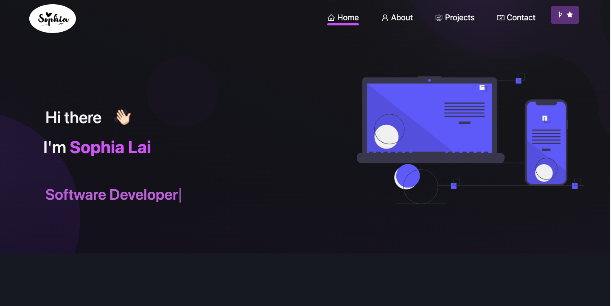

# Getting Started with [Sophia Portfoilo](https://sophia-lai-portfolio.netlify.app/)

 

# Installation and Setup Instructions

1. git clone `https://github.com/sophialai123/react-portfolio.git`

2. Installation: npm install

3. In the project directory, you can run: npm start

